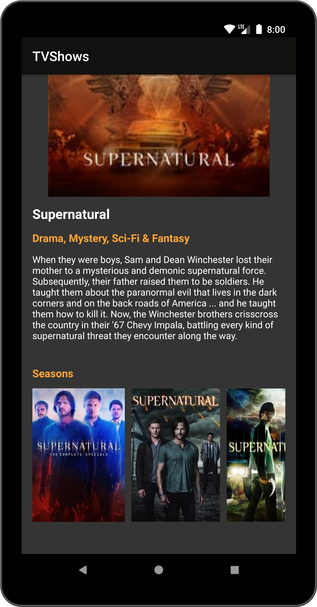

# TV Shows

A simple app written using Kotlin and MVVM design pattern. The app shows infinite list of TV shows and their details retrieved from TMDb API.

## API Key

Create an [API key][1].

Add your API key to `API_KEY = "your_api_key"` in `Constants.kt` file.

## Libraries

- Dagger 2
- Retrofit
- Room
- Paging 3
- RxJava 2
- Picasso
- Mockito
- JUnit

## Testing

The project contains  [Local unit tests][2] and [Instrumented tests][3].

Just run `./gradlew test` or `./gradlew connectedAndroidTest`

## Screenshots

 

[1]: https://www.themoviedb.org/documentation/api
[2]: app/src/test/java/com/example/tvshows/
[3]: app/src/androidTest/java/com/example/tvshows/
