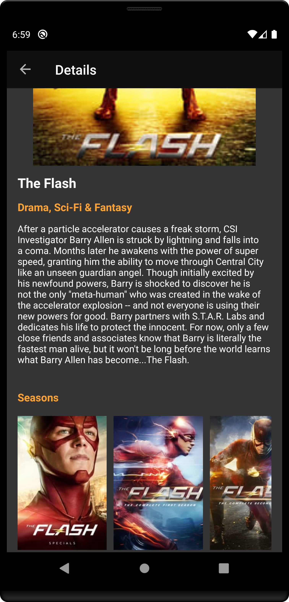

# TV Shows

A simple app written using Kotlin and MVVM design pattern. The app shows infinite list of TV shows and their details retrieved from TMDb API.

## Libraries

- Dagger 2
- Retrofit
- Room
- Paging 3
- RxJava 2
- Picasso
- Mockito
- JUnit
- MockWebServer

## Testing

The project contains  [Local unit tests][1] and [Instrumented tests][2].

Just run `./gradlew test` or `./gradlew connectedAndroidTest`

## Screenshots

 

[1]: app/src/test/java/com/example/tvshows/
[2]: app/src/androidTest/java/com/example/tvshows/
